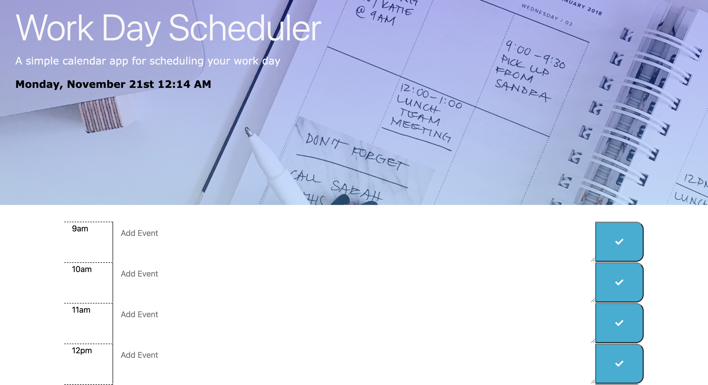

# 05-work-day-scheduler

## Description
Work Day Scheduler is a simple calendar application that allows a user to save events for each hour of the day. This app will run in the browser and feature dynamically updated HTML and CSS powered by jQuery.

## Installation
To view the project in your browser:
1. You will need to clone down the repository from GitHub to your local machine. 
2. Once you have the project locally, you will need to open it in VSCode IDE. Right-click on the `index.html` file, then select `default browser` from the dropdown menu. This will open the HTML page in the broswer of your choice.

## Deployment

Application is deployed through Github Pages, live URL [Workday Scheduler Website Link](https://westgards.github.io/05-work-day-scheduler/src/app/)

## Features
- Dynamically updated HTML, CSS, and JavaScript powered by jQuery.
- Responsive user interface that adapts to multiple screen sizes.
- Uses Unsplash Developers API for free random images based on keywords.

## Credits

Tutorials:

[U of MN Coding Bootcamp Link](https://github.com/coding-boot-camp)
[Moment js Library](https://momentjs.com/)
[Bootstrap tutorial]( https://www.bitdegree.org/learn/bootstrap-col-md)
[Colorlib Bootstrap Jumbotrons](https://colorlib.com/wp/bootstrap-jumbotrons/)
[Unsplash Developers API](https://unsplash.com/documentation#get-a-random-photo )

